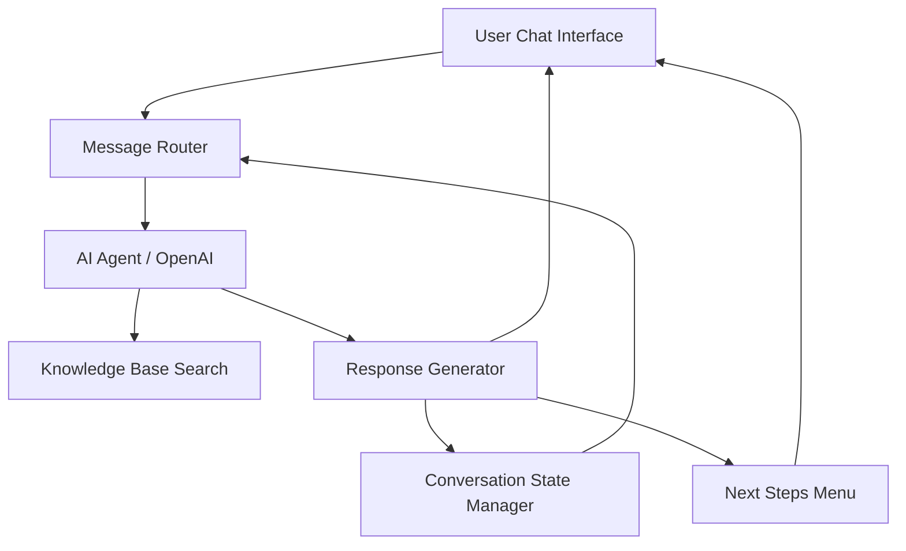

# Ask My AI - AI-Powered Chat Assistant 🤖


A Next.js application that provides an AI-powered chat interface to ask questions about your experience, skills, and projects. This is a customizable template - personalize it to create your own "Ask [Your Name]" assistant.

## 🎨 Customization

See **[Customization Guide](docs/customization.md)** for a complete guide on personalizing this template with your own information.

Quick start: Edit `src/config/site.ts` to change your name, title, and welcome messages.

## 📚 Documentation

### Getting Started
- **[Customization Guide](docs/customization.md)** - Personalize the template with your own information
- **[Development Guide](docs/development.md)** - Local setup, code standards, and common tasks
- **[Deployment Guide](docs/deployment.md)** - Production deployment to Vercel, Docker, or self-hosted

### Core Documentation
- **[Architecture](docs/architecture.md)** - System architecture overview with Mermaid diagrams
- **[Chat System](docs/chat-system.md)** - Message flow, session management, and components
- **[Context Drawer](docs/context-drawer.md)** - Context drawer system and data flow
- **[API Routes](docs/api-routes.md)** - Complete API reference
- **[File Processing](docs/file-processing.md)** - PDF extraction and file handling

### Integration Guides
- **[OpenAI Integration](docs/openai-integration.md)** - Assistant API setup and configuration
- **[LinkedIn OAuth](docs/linkedin-oauth.md)** - LinkedIn OAuth integration for profile import
- **[Resend Setup](docs/resend-setup.md)** - Email integration for bug reports and suggestions
- **[Calendar Setup](docs/calendar-setup.md)** - Cal.com integration for scheduling

### Testing
- **[Testing Guide](docs/testing.md)** - Manual testing, API testing, and integration workflows

## Features

- **AI-Powered Chat**: Conversational interface powered by OpenAI's Assistants API
- **Streaming Responses**: Real-time streaming for faster response times
- **Context Support**: Add LinkedIn profile or job details for personalized responses
- **Suggested Questions**: Categorized question prompts to get started quickly
- **Mermaid Diagrams**: Automatic rendering of Mermaid diagrams in responses
- **Next Steps Menu**: Quick actions including:
  - Schedule a call
  - Download resume (multiple formats)
  - View LinkedIn profile
  - Suggest a question for the knowledge base
  - Report issues
- **Session Persistence**: Chat history saved in session storage
- **Dark Theme**: Modern, responsive dark UI

## Tech Stack

- **Framework**: Next.js 16.1.0 with App Router
- **Language**: TypeScript
- **Styling**: Tailwind CSS
- **AI**: OpenAI Assistants API
- **Animations**: Framer Motion
- **Icons**: Lucide React
- **Markdown**: React Markdown with GitHub Flavored Markdown
- **Diagrams**: Mermaid for flowcharts, sequence diagrams, and more

## Prerequisites

- Node.js 18+
- npm or pnpm
- OpenAI API key
- OpenAI Assistant ID

## Getting Started

### 1. Clone the repository

```bash
git clone <repository-url>
cd askmyai
```

### 2. Install dependencies

```bash
npm install
# or
pnpm install
```

### 3. Customize the site

Edit **`src/config/site.ts`** to personalize with your information:

```typescript
export const siteConfig = {
  name: "Your Name",  // Change this!
  title: "Ask Your Name | AI-Powered Chat Assistant",
  welcomeHeading: "Chat with an AI version of Your Name",
  welcomeSubheading: "Ask me about my experience, skills, projects.",
  url: "https://yoursite.com",
  linkedInUrl: "https://linkedin.com/in/your-profile",
  // ... see docs/customization.md for full options
};
```

### 4. Set up OpenAI Assistant

1. Go to [OpenAI Platform](https://platform.openai.com/)
2. Navigate to Assistants section
3. Create a new assistant with:
   - **Name**: "Ask [Your Name] Assistant"
   - **Instructions**: Customize with your personal information
   - **Model**: gpt-4 or gpt-4-turbo
   - **Knowledge Files**: Upload your resume, portfolio data, project descriptions
   - **Capabilities**: Enable Code Interpreter if needed
4. Copy the Assistant ID

### 5. Configure environment variables

Create a `.env.local` file in the root directory:

```env
OPENAI_API_KEY=sk-your-key-here
OPENAI_ASSISTANT_ID=asst-your-id-here
```

### 6. Add your resume (optional)

1. Add PDF files to `public/resumes/`
2. Update `src/config/site.ts`:

```typescript
resumes: [
  {
    title: "Standard Resume",
    subtitle: "Software Engineer",
    description: "Full stack software engineer resume",
    filename: "my-resume.pdf",
  },
],
```

### 7. Run the development server

```bash
npm run dev
```

Open [http://localhost:3000](http://localhost:3000) in your browser.

### 8. Customize suggested questions

Edit **`src/components/SuggestedQuestions.tsx`** to add questions relevant to your background.

See **[Customization Guide](docs/customization.md)** for complete step-by-step instructions.

## Architecture

> **📚 For detailed architecture documentation with comprehensive diagrams, see [Architecture Guide](docs/ARCHITECTURE.md)**

The application follows a multi-component architecture similar to Ask Frankie:



### Components

- **User Chat Interface** (`src/app/page.tsx`): Where users interact with the system
- **Message Router** (`src/services/MessageRouter.ts`): Handles incoming messages, routes them to the AI agent
- **AI Agent** (OpenAI Assistants API): Processes queries, decides if knowledge base lookup is needed
- **Knowledge Base Search** (`src/services/KnowledgeBaseSearch.ts`): Retrieves relevant info for experience, skills, background
- **Response Generator** (`src/services/ResponseGenerator.ts`): Crafts responses pulling from knowledge base and context
- **Conversation State Manager** (`src/services/ConversationStateManager.ts`): Tracks user context, job descriptions, and previous messages
- **Next Steps Menu** (`src/components/NextStepsMenu.tsx`): Offers actions like scheduling a call, downloading a resume, etc.

### Request Flow

1. User sends message through chat interface
2. Message Router receives and validates the request
3. Conversation State Manager updates with user context
4. Knowledge Base Search retrieves relevant information (handled by OpenAI)
5. Response Generator crafts personalized response
6. Conversation State Manager stores the interaction
7. Response flows back to user with Next Steps options

## Project Structure

```
askmyai/
├── src/
│   ├── app/
│   │   ├── api/                    # API routes
│   │   │   ├── auth/               # LinkedIn OAuth
│   │   │   ├── chatbot/            # Main chat endpoint
│   │   │   ├── fetch-greenhouse/   # Greenhouse job scraper
│   │   │   ├── report-issue/       # Bug reporting
│   │   │   └── suggest-question/   # Question suggestions
│   │   ├── layout.tsx              # Root layout with metadata
│   │   ├── page.tsx                # Main chat page
│   │   └── globals.css             # Global styles
│   ├── components/
│   │   ├── chat/                   # Chat-specific components
│   │   │   ├── ChatHeader.tsx
│   │   │   ├── ChatInput.tsx
│   │   │   ├── ChatMessage.tsx
│   │   │   └── ChatMessages.tsx
│   │   ├── context-drawer/         # Context drawer tabs
│   │   │   ├── ContextDrawer.tsx
│   │   │   ├── LinkedInTab.tsx
│   │   │   ├── GreenhouseTab.tsx
│   │   │   ├── JobBoardTab.tsx     # Reusable tab component
│   │   │   ├── TextTab.tsx
│   │   │   ├── ImagesTab.tsx
│   │   │   ├── FilesTab.tsx
│   │   │   └── DragDropUpload.tsx
│   │   ├── modals/
│   │   │   ├── Modal.tsx
│   │   │   ├── ScheduleCallModal.tsx
│   │   │   ├── DownloadResumeModal.tsx
│   │   │   ├── SuggestQuestionModal.tsx
│   │   │   ├── ReportIssueModal.tsx
│   │   │   └── KeyboardShortcutsModal.tsx
│   │   ├── MermaidDiagram.tsx
│   │   ├── NextStepsMenu.tsx
│   │   └── SuggestedQuestions.tsx
│   ├── config/
│   │   ├── site.ts                 # ⭐ Site configuration (customize here!)
│   │   └── site.example.ts         # Example configurations
│   ├── contexts/
│   │   └── ThemeContext.tsx        # Dark mode context
│   ├── hooks/
│   │   └── useChatLogic.ts         # Chat state management
│   ├── services/
│   │   ├── MessageRouter.ts
│   │   ├── KnowledgeBaseSearch.ts
│   │   ├── ResponseGenerator.ts
│   │   └── ConversationStateManager.ts
│   ├── lib/
│   │   └── utils.ts
│   └── types/
│       └── chat.ts                 # TypeScript types
├── public/
│   ├── resumes/                    # Resume PDF files
│   ├── icon.svg                    # Favicon
│   ├── apple-icon.png              # Apple touch icon
│   └── og-image.png                # Social media preview
├── docs/                           # 📚 Complete documentation
│   ├── readme.md                   # Documentation index
│   ├── customization.md            # Customization guide
│   ├── development.md              # Development guide
│   ├── deployment.md               # Deployment guide
│   ├── testing.md                  # Testing guide
│   ├── architecture.md             # Architecture overview
│   ├── chat-system.md              # Chat system details
│   ├── context-drawer.md           # Context drawer system
│   ├── api-routes.md               # API reference
│   ├── file-processing.md          # File handling
│   ├── openai-integration.md       # OpenAI setup
│   ├── linkedin-oauth.md           # LinkedIn OAuth
│   ├── calendar-setup.md           # Cal.com integration
│   └── resend-setup.md             # Email integration
├── .env.local                      # Environment variables (create this)
├── .env.example                    # Example environment file
├── next.config.js                  # Next.js configuration
├── tailwind.config.ts              # Tailwind CSS config
├── tsconfig.json                   # TypeScript config
├── package.json                    # Dependencies
└── README.md                       # This file
```

## Using Diagrams

The chat assistant can render Mermaid diagrams automatically. When the AI responds with a code block marked as `mermaid`, it will be rendered as an interactive diagram.

Example questions that might generate diagrams:
- "Diagram the Ask My AI chat architecture"
- "Show me a flowchart of your development process"
- "Create a sequence diagram for the API workflow"

The AI can generate:
- Flowcharts
- Sequence diagrams
- Class diagrams
- State diagrams
- Entity relationship diagrams
- And more!

## Customization

### Quick Start: Update Site Configuration

The easiest way to customize this template is to edit the **single configuration file**:

**`src/config/site.ts`**

```typescript
export const siteConfig = {
  // Change to your name (e.g., "Nick", "Matt", "Lindsey")
  name: "My AI",

  // Update site metadata
  title: "Ask My AI | AI-Powered Chat Assistant",
  description: "Chat with an AI assistant...",

  // Customize welcome message
  welcomeHeading: "Chat with an AI assistant",
  welcomeSubheading: "Ask me about my experience, skills, projects.",

  // Update your URLs
  url: "https://askmyai.vercel.app",
  linkedInUrl: "https://linkedin.com/in/your-profile",

  // Email subject prefix
  emailSubjectPrefix: "Ask My AI",

  // SEO keywords
  keywords: ["AI", "Chat", "Assistant", "Portfolio", "Software Engineer"],

  // Resume files - Just add files to public/resumes/ and list them here!
  resumes: [
    {
      title: "Standard Resume",
      subtitle: "Software Engineer",
      description: "Full stack software engineer resume",
      filename: "resume.pdf",
    },
  ],
};
```

This **one file** controls:
- ✅ Site title and metadata
- ✅ Header text ("Ask [Your Name]")
- ✅ Welcome messages
- ✅ Email subjects for bug reports
- ✅ OpenGraph/social media cards
- ✅ SEO keywords
- ✅ Resume downloads (just add PDFs to `public/resumes/`)

### Additional Customization

For more advanced personalization:

1. **`src/components/SuggestedQuestions.tsx`** - Customize suggested questions for your background
2. **OpenAI Assistant** - Update instructions with your personal information
3. **`public/og-image.png`** - Replace with your own social media preview image

### Update Resume Formats

Edit `src/components/modals/DownloadResumeModal.tsx` to customize resume options and filenames.

### Customize Theme

Edit `tailwind.config.ts` to modify colors and styles:

```typescript
colors: {
  background: "#0a0a0a",
  foreground: "#ffffff",
  primary: "#1a1a1a",
  secondary: "#2a2a2a",
  accent: "#3b82f6",
  muted: "#666666",
}
```

## Deployment

### Vercel (Recommended)

1. Push your code to GitHub
2. Import project in Vercel
3. Add environment variables in Vercel dashboard
4. Deploy

### Other Platforms

The application can be deployed to any platform that supports Next.js:

- Netlify
- AWS Amplify
- Railway
- Render

Make sure to:
- Set environment variables
- Configure build command: `npm run build`
- Configure start command: `npm start`

## API Routes

### POST /api/chatbot

Main chatbot endpoint that handles chat messages with streaming support.

**Request Body:**
```json
{
  "message": "Tell me about yourself",
  "threadId": "thread_abc123",
  "context": {
    "linkedInProfile": "https://linkedin.com/in/...",
    "jobUrl": "https://...",
    "additionalContext": "..."
  }
}
```

**Response:**
Streaming JSON responses with:
```json
{
  "response": "...",
  "threadId": "thread_abc123"
}
```

## Troubleshooting

### "Assistant not configured" error

Make sure `OPENAI_ASSISTANT_ID` is set in your `.env` file.

### Streaming timeout

The API route has a 60-second timeout (configured with `maxDuration`). For Vercel Hobby plan, reduce to 10 seconds.

### Chat history not persisting

Clear browser cache and ensure session storage is enabled.

## License

This project is licensed under the [MIT License](LICENSE).

## Acknowledgments

- Built with [Next.js](https://nextjs.org/)
- Powered by [OpenAI](https://openai.com/)
- UI components inspired by modern chat interfaces
