# Architecture Documentation

This document provides a comprehensive overview of the Ask My AI chat application architecture.

## Table of Contents

- [High-Level Architecture](#high-level-architecture)
- [Component Architecture](#component-architecture)
- [Data Flow](#data-flow)
- [Service Layer](#service-layer)
- [State Management](#state-management)
- [API Architecture](#api-architecture)
- [Frontend Architecture](#frontend-architecture)

## High-Level Architecture

The application follows a multi-component architecture inspired by Ask Frankie, with clear separation of concerns between different system components.

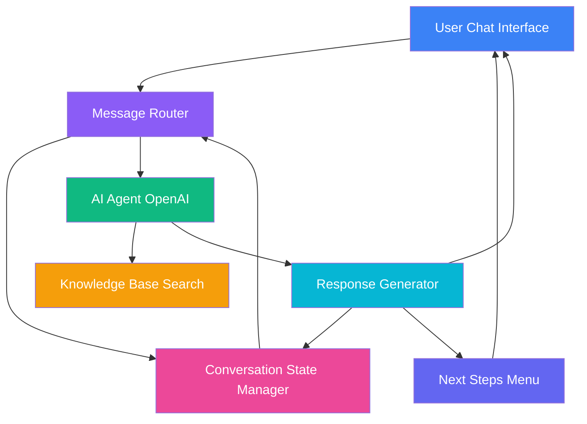

## Component Architecture

### Frontend Components

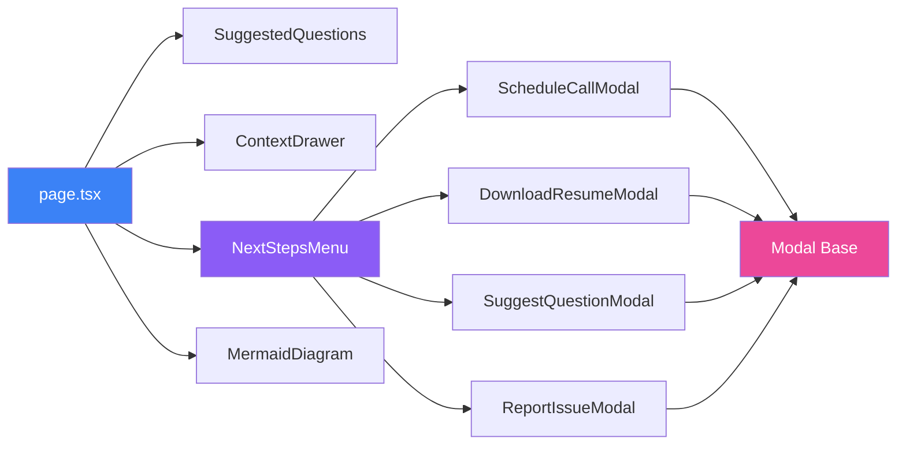

### Backend Services

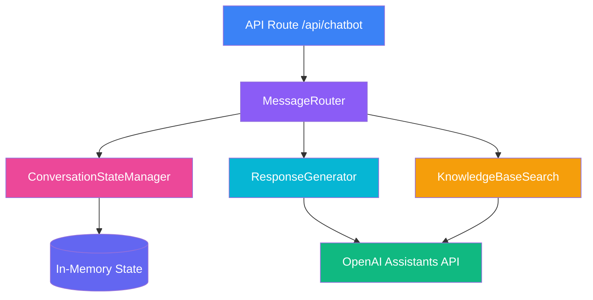

## Data Flow

### Message Processing Flow

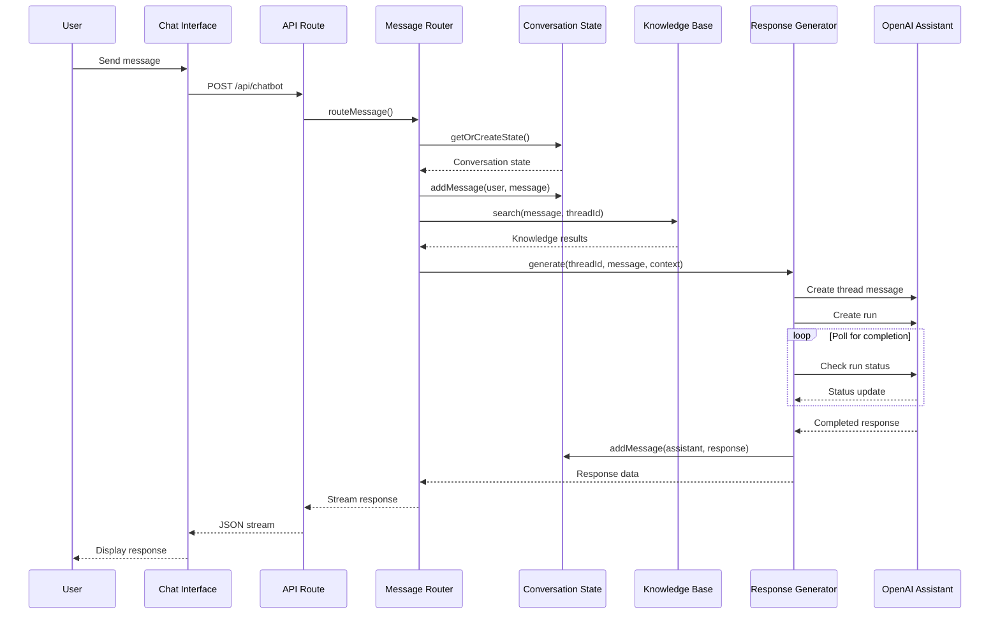

### Context Management Flow

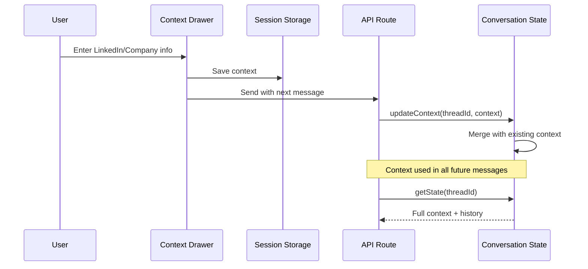

## Service Layer

### MessageRouter Service

**Responsibilities:**
- Route incoming messages to appropriate handlers
- Coordinate between different services
- Manage thread lifecycle
- Handle errors and timeouts

**Key Methods:**
```typescript
routeMessage(message: string, threadId?: string, context?: Context)
getConversationHistory(threadId: string)
```

### ConversationStateManager Service

**Responsibilities:**
- Track conversation state across messages
- Store user context (LinkedIn, job details)
- Maintain message history
- Cleanup old conversations

**Key Methods:**
```typescript
getOrCreateState(threadId: string, context?: Context)
addMessage(threadId: string, role: string, content: string)
updateContext(threadId: string, context: Context)
getRecentHistory(threadId: string, count: number)
cleanup(maxAge: number)
```

### KnowledgeBaseSearch Service

**Responsibilities:**
- Interface with knowledge base
- Search uploaded files (via OpenAI)
- Retrieve assistant information
- Extensible for custom search implementations

**Key Methods:**
```typescript
search(query: string, threadId: string)
getAssistantInfo()
listKnowledgeFiles()
```

### ResponseGenerator Service

**Responsibilities:**
- Generate AI responses
- Handle context injection
- Poll OpenAI for completion
- Extract and clean responses

**Key Methods:**
```typescript
generate(threadId: string, message: string, context?: Context)
```

## State Management

### Client-Side State

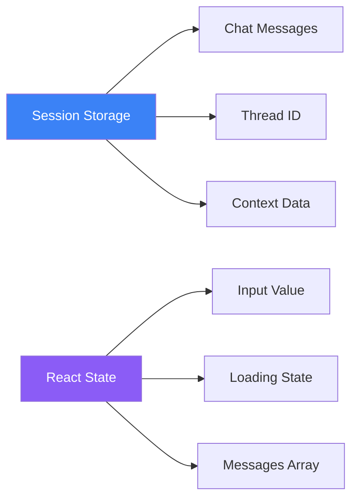

**Session Storage:**
- `chat-messages`: Array of message objects
- `chat-thread-id`: Current OpenAI thread ID
- `chat-context`: User context (LinkedIn, company)

**React State:**
- `messages`: Current conversation messages
- `inputValue`: Current input field value
- `isLoading`: Loading state for API calls
- `threadId`: Active thread ID
- `context`: Current user context

### Server-Side State

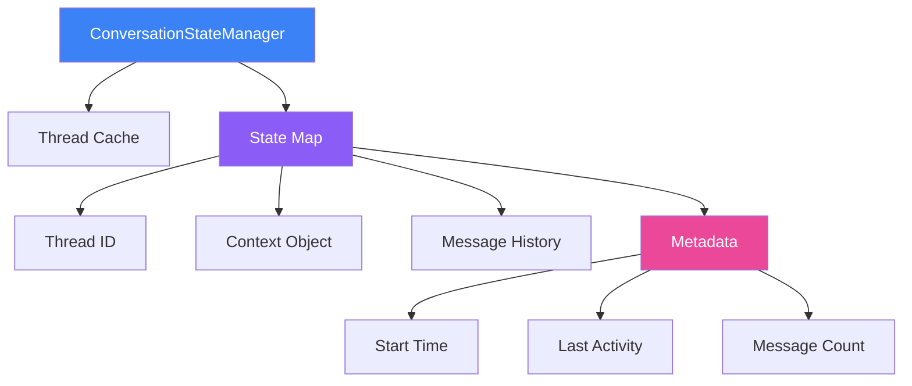

## API Architecture

### Endpoint: POST /api/chatbot

**Request:**
```json
{
  "message": "string",
  "threadId": "string (optional)",
  "context": {
    "linkedInProfile": "string (optional)",
    "jobUrl": "string (optional)",
    "additionalContext": "string (optional)"
  }
}
```

**Response Stream:**
```json
{
  "response": "string",
  "threadId": "string"
}
```

**Error Response:**
```json
{
  "error": "string"
}
```

### Request Flow

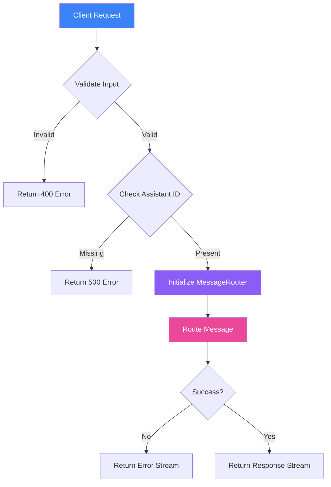

## Frontend Architecture

### Component Hierarchy

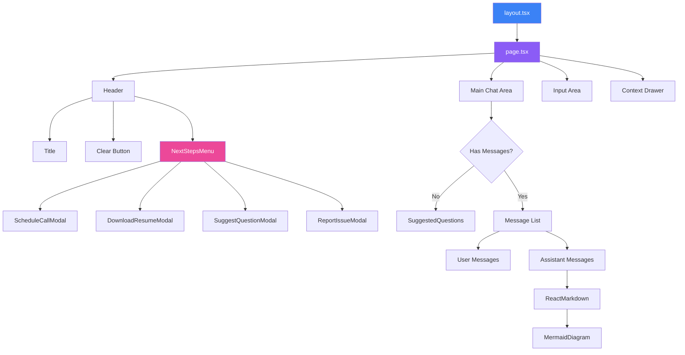

### UI State Flow

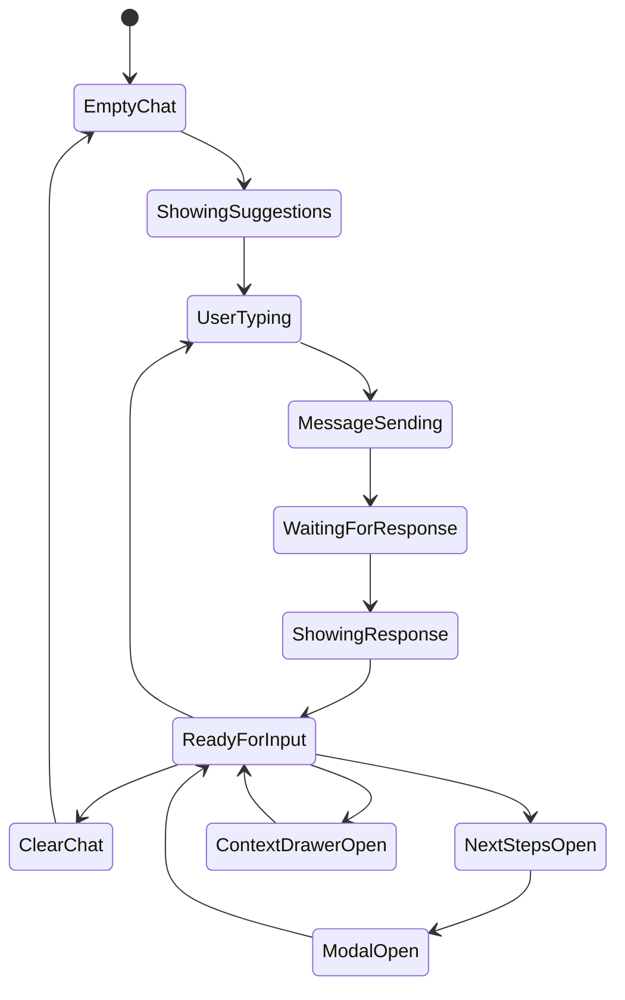

## Technology Stack

### Frontend
- **Framework**: Next.js 16 (App Router)
- **Language**: TypeScript
- **Styling**: Tailwind CSS
- **Animations**: Framer Motion
- **Markdown**: React Markdown + GFM
- **Diagrams**: Mermaid
- **Icons**: Lucide React

### Backend
- **Runtime**: Node.js (Next.js API Routes)
- **AI**: OpenAI Assistants API
- **State**: In-memory (Map-based)
- **Streaming**: ReadableStream API

### Development
- **Package Manager**: npm
- **Linter**: ESLint
- **Formatter**: Prettier
- **Type Checking**: TypeScript

## Deployment Architecture

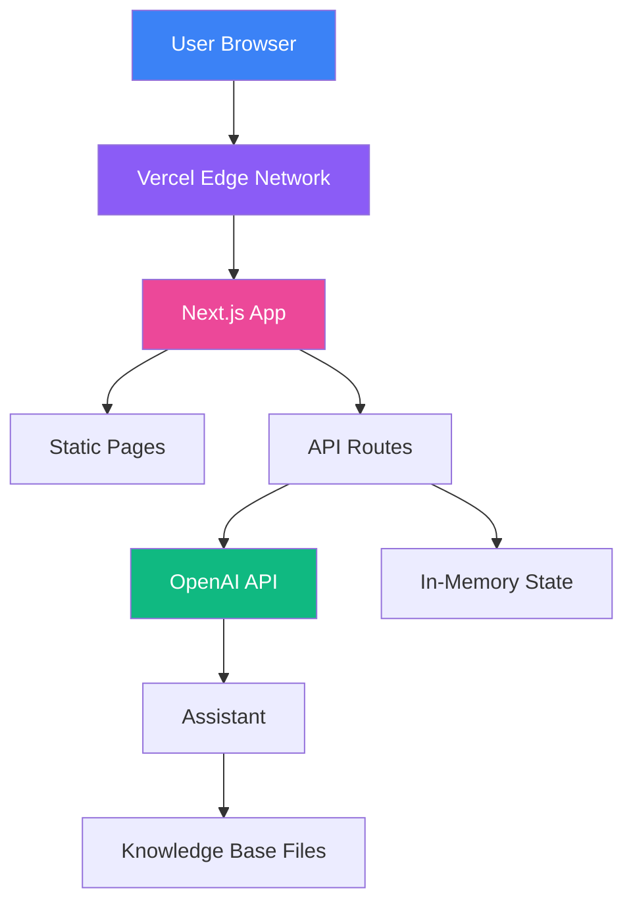

## Security Considerations

1. **API Key Management**
   - OpenAI API key stored in environment variables
   - Never exposed to client-side code

2. **Input Validation**
   - All user inputs validated before processing
   - Message content sanitized

3. **Rate Limiting**
   - Implemented via Vercel function limits
   - 60-second max duration per request

4. **State Isolation**
   - Each thread has isolated state
   - No cross-thread data leakage

5. **Session Management**
   - Client-side session storage (not cookies)
   - No persistent user tracking

## Performance Optimizations

1. **Streaming Responses**
   - JSON streaming for faster perceived response time
   - Immediate user feedback

2. **State Caching**
   - Thread IDs cached in memory
   - Reduces OpenAI API calls

3. **Conversation Cleanup**
   - Automatic cleanup of old conversations
   - Prevents memory bloat

4. **Component Lazy Loading**
   - Modal components loaded on demand
   - Reduced initial bundle size

5. **Mermaid Rendering**
   - Client-side only rendering
   - No SSR overhead

## References

- [Next.js Documentation](https://nextjs.org/docs)
- [OpenAI Assistants API](https://platform.openai.com/docs/assistants)
- [Mermaid Diagram Syntax](https://mermaid.js.org/)
- [Tailwind CSS](https://tailwindcss.com/)
